[](https://dev.azure.com/bmustafah/flask-ml-app/_build/latest?definitionId=1&branchName=main)

# Udacity - DevOps - Project 2 - Building a CI/CD Pipeline


We should build an automated devops process to build a Flask app.

This was done by using CI/CD (Continuous Integration and Continuous Delivery), with the following two methods:

* **Github Actions** with a Makefile, requirements.txt and application code to perform linting, test, and installtion.

* **Azure Pipelines** Continuous Delivery to Azure Web App Service.  

Start with this code provided by Udacity for this project: [Azure-Cloud-DevOps-Starter-Code](https://github.com/udacity/nd082-Azure-Cloud-DevOps-Starter-Code)  

## Architectural Diagram
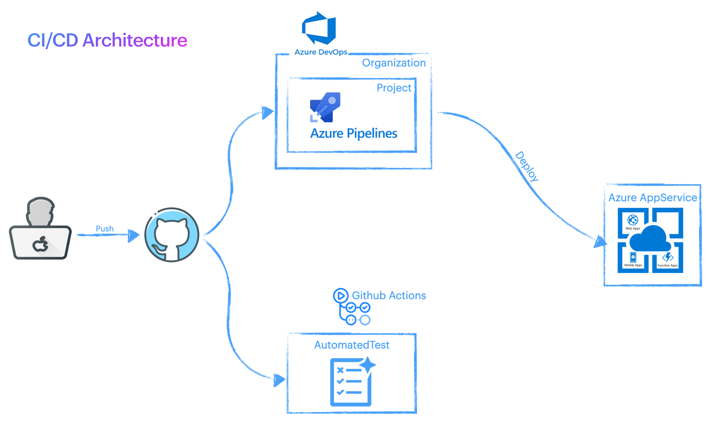

## How To ?

##### 1. Prerequisites

* [Azure account](https://azure.microsoft.com/en-us/)

* [Azure DevOps account](https://dev.azure.com/)

* [GitHub account](https://github.com/)
 
##### 2. SSH

* Login to Azure shell - `az login`  
* Using the Azure Cloud Shell, create an SSH rsa public/private key pair
  
##### 3. Clone 

Go to your github repository to get the link.  
Click the "Clone" button, select "SSH" and then click the "Copy" button next to the git address.  

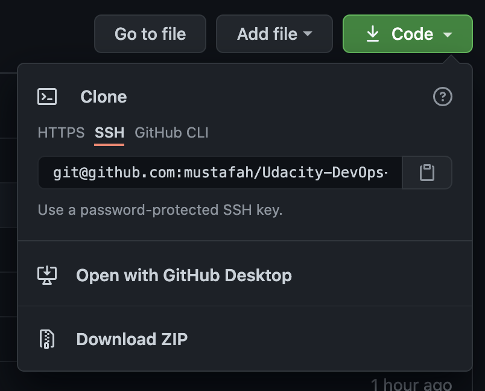

clone the repository In the Azure Cloud Shell

```
git clone <paste_repository_link>.git
```

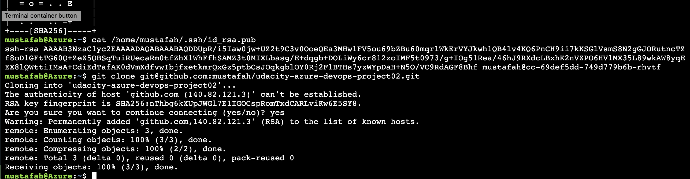  


##### Validate
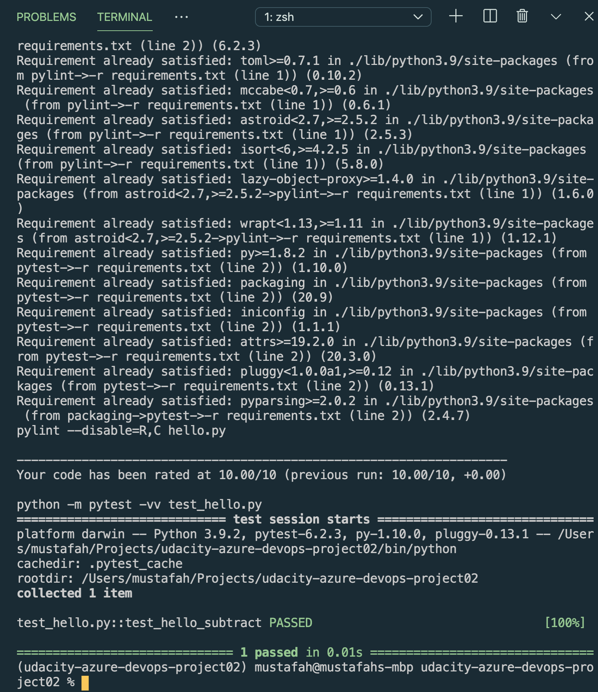  


##### 4. GitHub Actions 

* Click on "Actions", under GitHub repository name.
* Click "Setup this workflow" under "Python application"
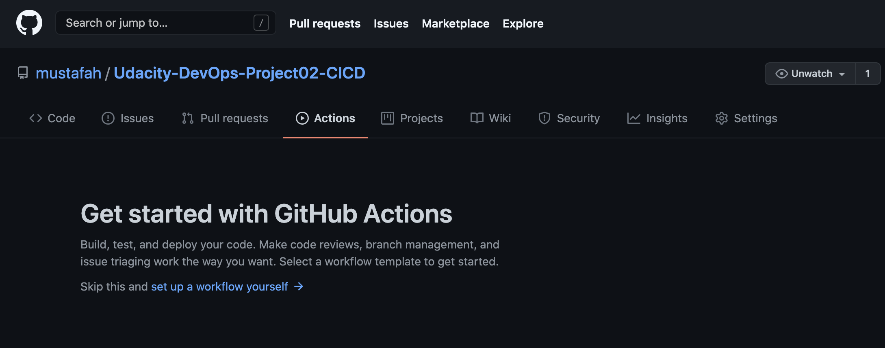
* Replace the file contents with the contents of the .github/workflows/python-app.yml file
* Click "Start commit"

When the action is triggered, you should expect the following:
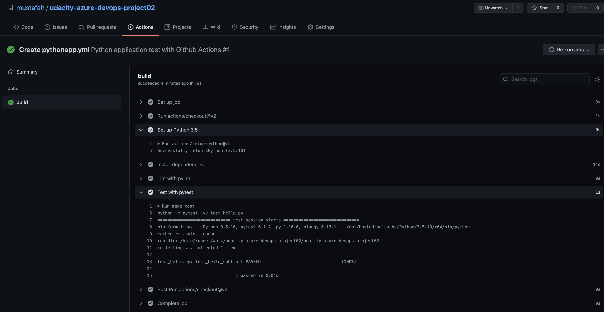

##### 5. Azure AppService
Create the App Service and initially deply the app in the Azure Cloud Shell. 
This step can be done in the portal. 

`az webapp up --sku S1 -n mustafah-flask-ml-app`
You can verify that the app is working by navigating to the deployed URL.   
Go to `https://mustafah-flask-ml-app.azurewebsites.net.` 
It should look like this:
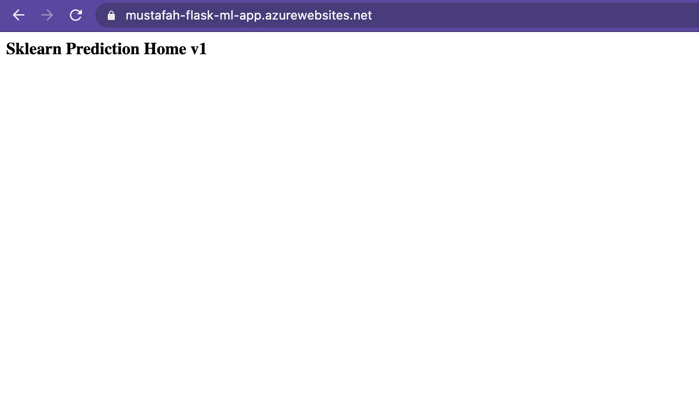

##### 6. Run

Run a test of the app:
```
./make_predict_azure_app.sh
```
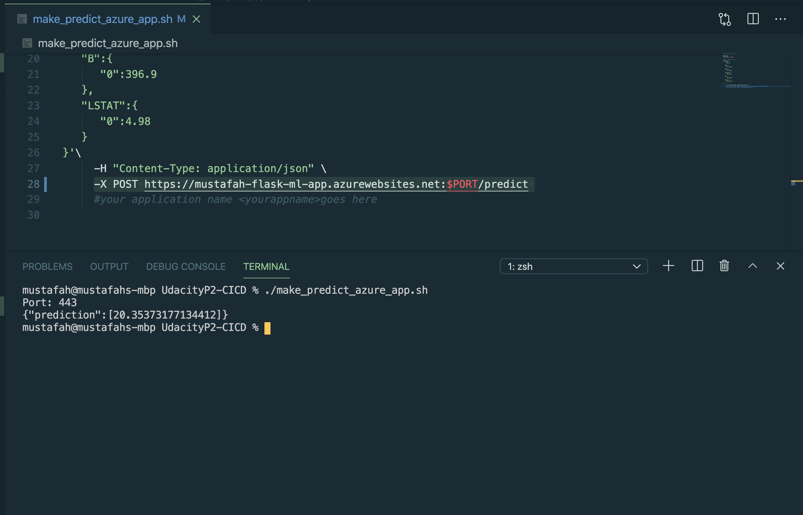

##### 7. Logs

Check the logs
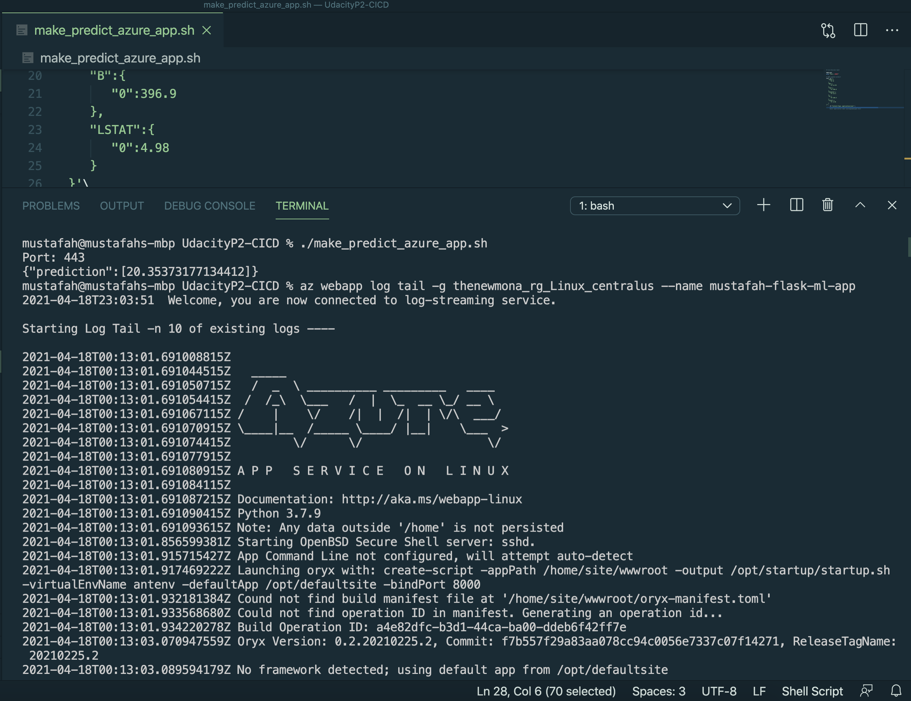

##### 8. Azure pipelines

Azure piplelines automate the deployment.

Make a connection between Azure pipelines and GitHub.

* Sign in to [Azure DevOps](https://dev.azure.com/)
* Select "Create project"
* From the new project page, select Project settings from the left navigation
* On the Project Settings page, select Pipelines > Service connections, then select New service connection, and then select Azure Resource Manager from the dropdown
* In the "Add an Azure Resource Manager service connection" dialog box 
    * Enter a connection name
    * Scope level: Subscription
    * Select a resource group 
    * Check "Allow all pipelines to use this connection
* From your project page left navigation, select Pipelines
* Select New pipeline
* Select GitHub
* Select the repository that contains your app
* You may be redirected to GitHub. Click "Approve and Install"
* In the Configure your pipeline screen", select "Python to Linux Web App on Azure"
* On the top left of the screen, select your subscription and on the bottom right click "Continue"
* Select your web app name in the dropdown box, click "Validate and Configure"
* Click "Save and run"
 

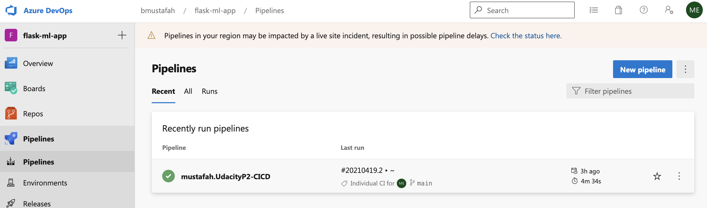

 Each time you make a commit, the pipeline will automatically pull the new version, it will try to build the application and if the build is successfull it will deploy it.

If you click on a pipeline you will see the commit history and an indicator if it was built and deployed sucessfully.

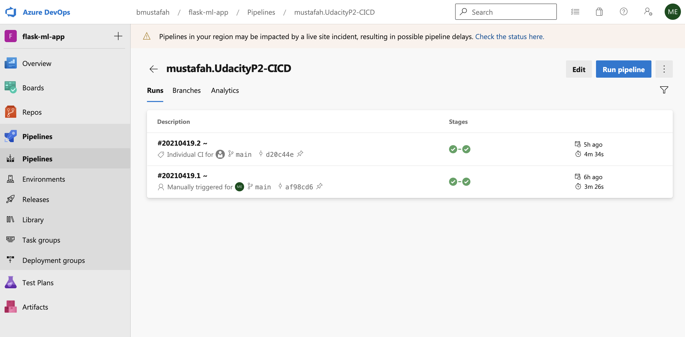


You can also click on the build stage or deploy app to get detailed status.
 This is useful for debugging.  
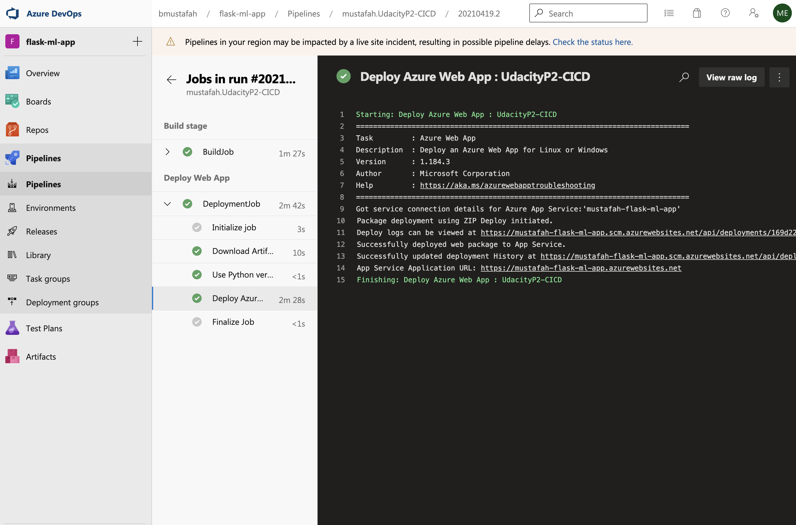

## Enhancements

1. Creating a Kubernetes version of this project. As it is an ideal platform for running CI/CD platforms, as it has plenty of features that make it easy to do so.

2. Create another version of the project where you replace the Azure Pipelines Continuous Delivery step with Github Actions. Which considered a more affordable option and more community support.

## Project Documentation
**Project Board**    

* [**Trello board for the project**](https://trello.com/b/yGpesDFF/udacity-devops-project02-ci-cd)  
  
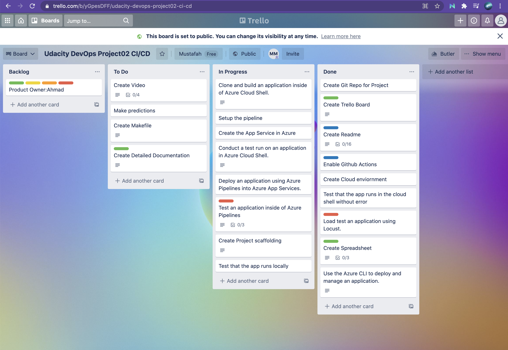

 **Project Plan**  
* [**Spreadsheet that includes the original and final project plan**](https://docs.google.com/spreadsheets/d/1XE0G1qxUyh_ZYNIRArMB9b4zKdatXySt_LIgS-r2PPA/edit?usp=sharing)


## Video demo
Watch it here [https://www.youtube.com/watch?v=fB-sMGyY2Kk](https://www.youtube.com/watch?v=fB-sMGyY2Kk)